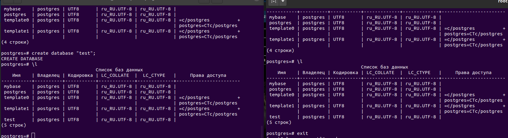
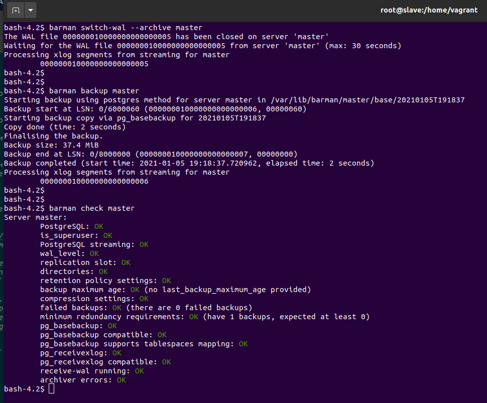

# репликация postgres

- Настроить hot_standby репликацию с использованием слотов
- Настроить правильное резервное копирование

Для сдачи работы присылаем ссылку на репозиторий, в котором должны обязательно быть
- Vagranfile (2 машины)
- плейбук Ansible
- конфигурационные файлы postgresql.conf, pg_hba.conf и recovery.conf,
- конфиг barman, либо скрипт резервного копирования.

Команда "vagrant up" должна поднимать машины с настроенной репликацией и резервным копированием.
Рекомендуется в README.md файл вложить результаты (текст или скриншоты) проверки работы репликации и резервного копирования.

# Исполнение

Выполните запуск стенда

          $ vagrant up
              
В результате будут запущены два сервера - master и slave

- Выполним обмен ключами между хостами. В playbook используются уже ранее сгенерированные ключи, при необходимости, можно создать свои, достаточно раскоментировать строчки в playbook maste.yml и slave.yaml
- После установки postgresql создадим роли для репликации: barman и replicant
- данные про ролям не забываем указать в файле pg_hba.conf  для обоих хостов.
- Разрешим слоты для репликации

Выполним проверку работы стенда:

1. Подключимся к хосту master 

          $ vagrant ssh master
          
2. Повысим привелегии 
          
          $ sudo -i
          
3. Подключимся к консоли posql 
          
          $ psql -U postgres
          
4. Используем пароль - postpass 
5. Проверим наличие баз данных  

          $ \l
          
6. Проверим, что базы у нас копируются на хост slave - создадим базу данных 

          $ create database "test";
          
7. Проверим ее наличие на master 

          $ \l
          
8. Подключимся к хосту slave 

          $ vagrant ssh slave
          
9. выполним пункты 2-5 чтобы убедиться, что бада была данные базы были скопированы на slave

​

Выполним проверку работы barman 

10. на хосте slave выполним переход под роль barman 

          $  su barman
          
11. Выполним команды:

          $ barman check master
          $ barman switch-wal --archive master
          $ barman backup master
          $ barman check master

​

# Документация
1. http://docs.pgbarman.org/release/2.12/
2. https://www.dmosk.ru/miniinstruktions.php?mini=postgresql-replication
3. https://postgrespro.ru/docs/postgrespro/9.5/creating-cluster
4. https://postgrespro.ru/docs/postgrespro/9.6/warm-standby
